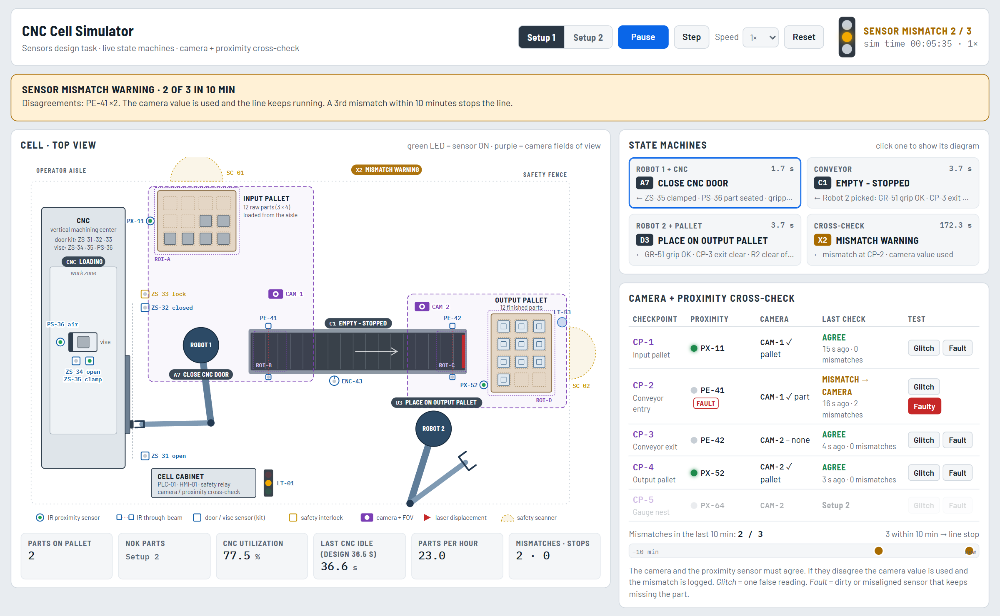

# CNC Cell Simulator

Sensors design and live state-machine simulation of a CNC machine-tending cell: a CNC with a
robot-operated door, two UR10e robots, a conveyor, and input and output pallets.



This is the solution to the Week 2 Sensors Design Task, Setup 1 and Setup 2: sensor selection and
placement, work-flow logic, state diagrams, the camera + proximity cross-check rule, the dimensional
check and the CNC-time optimization.

## Contents

| Path | What it is |
|---|---|
| `Sensors_Design_Report.docx` / `.pdf` | The full write-up (27 pages, 15 figures, 9 tables) |
| `simulation/index.html` | Interactive simulation of all state machines. Double-click to open it in a browser |
| `simulation/*.png` | Two screenshots of the simulation (also in the report) |
| `diagrams/` | Every figure as PNG (with title) and SVG (editable). Numbers match the report |
| `source/` | Scripts that generate the diagrams, the simulation and the report |

## Figures

| Figure | File |
|---|---|
| 1 | `fig01_layout_setup1` – cell layout and sensor placement, Setup 1 |
| 2 | `fig02_control_architecture` – the four state machines and their handshakes |
| 3 | `fig03_crosscheck_flow` – camera + proximity decision logic |
| 4 | `fig04_supervisor_states` – cross-check supervisor state diagram |
| 5 | `fig05_flow_setup1` – work flow of one part, Setup 1 |
| 6 | `fig06_states_robot1_setup1` – Robot 1 + CNC state diagram, Setup 1 |
| 7 | `fig07_states_conveyor` – conveyor state diagram |
| 8 | `fig08_states_robot2_setup1` – Robot 2 + output pallet state diagram, Setup 1 |
| 9 | `fig09_layout_setup2` – cell layout, Setup 2 |
| 10 | `fig10_timing_setup1_vs_setup2` – CNC idle time, Setup 1 vs Setup 2 |
| 11 | `fig11_flow_setup2` – work flow of one part, Setup 2 |
| 12 | `fig12_states_robot1_setup2` – Robot 1 + CNC state diagram, Setup 2 (dual gripper) |
| 13 | `fig13_states_robot2_setup2` – Robot 2 + gauge + sorting state diagram, Setup 2 |

## The cross-check rule in one paragraph

At five checkpoints (CP-1 input pallet, CP-2 conveyor entry, CP-3 conveyor exit, CP-4 output
pallet, CP-5 gauge nest) an IR proximity sensor and a camera confirm the same fact. They must
agree. If they disagree, the sequence uses the camera value and logs a mismatch. Three mismatches
within a 10-minute sliding window stop the line in a controlled way (the CNC finishes its part, the
robots park, the belt starts no new transport) until a technician verifies the sensors and resets.
Safety signals (door interlock, E-stops, scanners) are hardwired and never overridden by the camera.

## Key numbers

| | Setup 1 | Setup 2 |
|---|---|---|
| CNC idle per part | 36.5 s | 20.5 s |
| CNC utilization | 76.7 % | 85.4 % |
| Output | 23.0 parts/h | 25.6 parts/h |

Setup 2 rejects any part with a length, width or height below 48.00 mm into a locked NOK chute.

## Using the simulation

Open `simulation/index.html`. Choose Setup 1 or Setup 2, set the speed and watch the active state
move on the diagrams. Try **Fault** on CP-2: every part placed on the belt gives a mismatch, the camera
keeps the line running, and the third mismatch within 10 minutes stops the line. Then start the sensor
verification and reset. In Setup 2, press **Next part undersized** twice to see the NOK chute and the
quality hold. The page needs an internet connection only for its fonts.

## Rebuilding

Requires Node.js and Google Chrome. From `source/`:

```
npm install
node render.js out        # diagrams -> out/ (full) and out/doc/ (report versions)
node build_sim.js         # simulation -> out/sim/index.html
node capture_sim.js       # simulation screenshots for the report
node build_report.js      # report -> out/Sensors_Design_Report.docx
```

`render.js` and the other scripts expect Chrome at `C:/Program Files/Google/Chrome/Application/chrome.exe`.
Step times and rules live in `src/cell-model.js`; change them there and rebuild.
